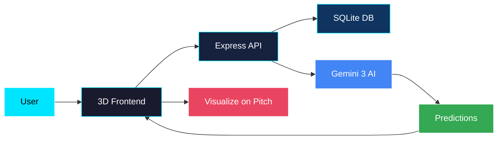
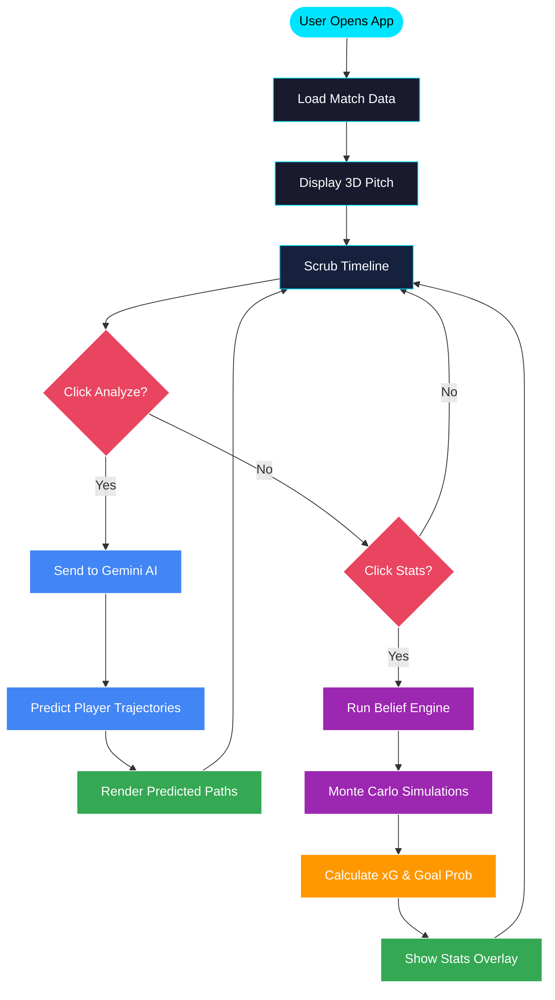

# MetaPitch Architecture

## How It Works

## Detailed Flow

## Tech Stack

| Component | Technology |
|-----------|------------|
| Frontend | React + Three.js |
| Backend | Express + Node.js |
| Database | SQLite |
| AI | Google Gemini 3 |
